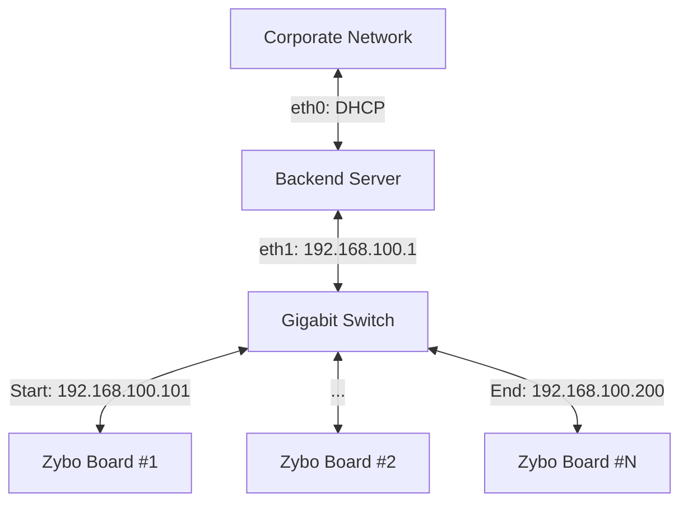

# 02. Network & Hardware Specification

This document details the physical connection, network protocols, and software requirements for the Zybo Boards (The "Agent").

## 1. Network Topology (Option B: Private Network)

We utilize a **Private Network** architecture where the Backend Server acts as the Gateway/Router for the Zybo farm.



### 1.1 IP Allocation Strategy
- **Service**: `dnsmasq` running on Backend.
- **Subnet**: `192.168.100.0/24`
- **Gateway**: `192.168.100.1`
- **Addressing**: Static Leases based on MAC Address.
    - Example: `AA:BB:CC:DD:EE:01` -> `192.168.100.101` (Board 1)

## 2. Communication Protocols

Traffic is divided into **Control Plane** (Instructions) and **Data Plane** (Waveforms).

### 2.1 Control Plane: HTTP REST
- **Direction**: Bidirectional.
- **Zybo Port**: 8000 (Agent requires a web server).
- **Backend Port**: 3000/8000 (API).

### 2.2 Data Plane: HTTP Stream
- **Why not SCP?**: Managing SSH keys across 100 dynamic boards is complex.
- **Why HTTP?**: Using chunked transfer encoding (`Transfer-Encoding: chunked`) via standard `PUT` requests is firewall-friendly and easy to debug.

## 3. Zybo Agent Software Specification

The Zybo board must run a lightweight Python service (`eval-agent`) that starts on boot.

### 3.1 Core Features

#### A. Phone Home (Auto-Discovery)
On boot, the Agent MUST detect the link and register itself.
- **Request**: `POST http://192.168.100.1/api/boards/register`
- **Payload**:
  ```json
  {
    "mac": "AA:BB:CC:DD:EE:01",
    "ip": "192.168.100.101",
    "firmware": "1.0.0",
    "model": "Zybo-Z7-20"
  }
  ```

#### B. Job Execution Engine
The Agent listens for commands to execute tests.
- **Endpoint**: `POST /execute`
- **Workflow**:
    1. **Download**: Pull generic firmware/VCD from Backend (`GET /files/:id`).
    2. **Flash**: Program FPGA via `openocd` or `impact`.
    3. **Run**: Drive VCD vectors.
    4. **Upload**: Stream captured binary back to Backend (`PUT /results/:id/stream`).

#### C. Telemetry (Heartbeat)
Every 30 seconds, report health.
- **Endpoint**: `POST /api/boards/heartbeat`
- **Payload**: `{"temp": 45.2, "cpu": 12.5}`

### 3.2 Agent API Reference (Listening on Zybo)

| Method | Path | Description | Payload |
| :--- | :--- | :--- | :--- |
| `POST` | `/execute` | Start a test job | `{"job_id": "...", "files": {...}}` |
| `POST` | `/cancel` | Stop current job | - |
| `POST` | `/restart` | Reboot Linux | - |
| `GET` | `/status` | Get current state | - |

## 4. Security
- **Firewall**: Backend `ufw` should allow incoming traffic on `eth1` only from `192.168.100.0/24`.
- **Isolation**: Zybo boards have NO direct internet access. Updates must be proxied via the Backend.
