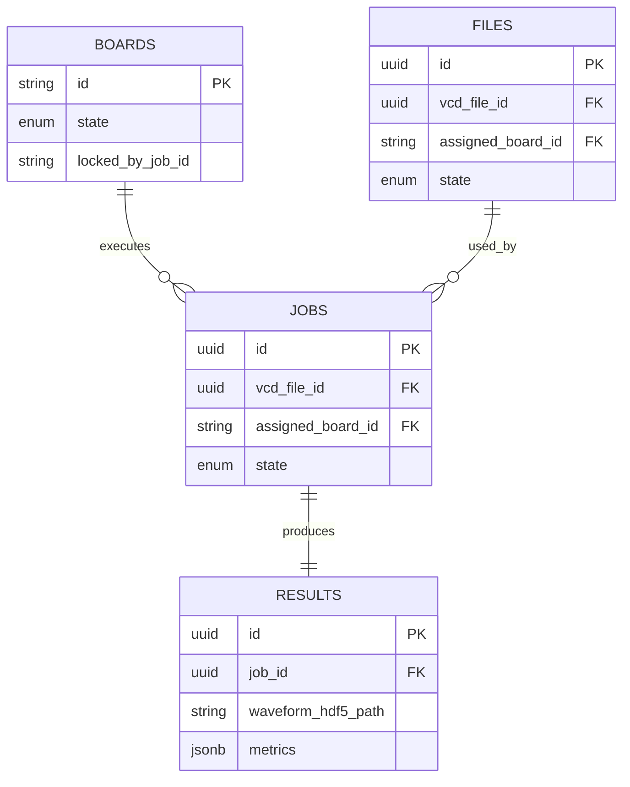

# Database Specification: Eval System V2

## 1. Overview
This document defines the database schema and data storage strategy for the Eval System V2.
A hybrid storage approach is used:
- **Relational Database (SQL)**: Stores structured metadata (Jobs, Boards, File index, Test status).
- **File System (HDF5)**: Stores high-volume waveform data.

## 2. Technology Stack
- **Database Engine**: PostgreSQL (Production) / SQLite(Dev)
- **ORM**: SQLAlchemy (Async) with Alembic for migrations.
- **Waveform Storage**: HDF5 (`.h5` files) on disk, indexed by DB.

## 3. Waveform Data Workflow
The system does not store large binary blobs in the database directly.
1.  **Receive**: Backend receives **Raw Binary** stream from the Hardware Interface (Board).
2.  **Process**: Backend converts Raw Binary → structured **HDF5** format (better for slicing/querying later).
3.  **Store**: HDF5 file is saved to `storage/waveforms/<YYYY>/<MM>/<job_id>.h5`.
4.  **Index**: The file path and metadata (packet count, duration) are saved in the `results` table.

---

## 4. Schema Definitions

### 4.1 Table: `boards`
**Purpose**: Inventory and real-time status of connected hardware.

| Column | Type | Nullable | Description |
| :--- | :--- | :--- | :--- |
| `id` | VARCHAR(32) | NO | Primary Key. Unique Board ID (e.g., `board-01`). |
| `name` | VARCHAR(255) | NO | Human-readable name (e.g., "Zybo Rack 1"). |
| `state` | ENUM | NO | `ONLINE`, `OFFLINE`, `BUSY`, `ERROR`. |
| `ip_address` | VARCHAR(45) | YES | IP Address for SSH/HTTP connection. |
| `mac_address` | VARCHAR(17) | YES | Hardware address. |
| `firmware_version` | VARCHAR(64) | YES | Currently installed firmware version. |
| `locked_by_job_id` | VARCHAR(32) | YES | FK to `jobs.id`. **Critical for concurrency control**. |
| `last_heartbeat` | TIMESTAMP | YES | Last successful ping time. |
| `created_at` | TIMESTAMP | NO | Registration time. |

### 4.2 Table: `files`
**Purpose**: Central registry for all files (Firmware, VCD, Drivers).

| Column | Type | Nullable | Description |
| :--- | :--- | :--- | :--- |
| `id` | UUID | NO | Primary Key. |
| `filename` | VARCHAR(255) | NO | Original upload filename. |
| `file_type` | ENUM | NO | `FIRMWARE`, `VCD`, `SCRIPT`. |
| `storage_path` | VARCHAR(512) | NO | Absolute/Relative path on server disk. |
| `checksum_sha256` | VARCHAR(64) | NO | Integrity check. |
| `size_bytes` | BIGINT | NO | File size. |
| `uploaded_at` | TIMESTAMP | NO | Upload timestamp. |

### 4.3 Table: `jobs`
**Purpose**: Execution queue and history.

| Column | Type | Nullable | Description |
| :--- | :--- | :--- | :--- |
| `id` | UUID | NO | Primary Key. |
| `name` | VARCHAR(255) | NO | Job name/Label. |
| `priority` | INTEGER | NO | Default 0. Higher runs first. |
| `state` | ENUM | NO | `PENDING`, `RUNNING`, `COMPLETED`, `FAILED`, `CANCELLED`. |
| `target_board_id` | VARCHAR(32) | YES | If user pinned a specific board. |
| `assigned_board_id` | VARCHAR(32) | YES | Board physically used (FK to `boards.id`). |
| `vcd_file_id` | UUID | NO | FK to `files.id`. Test Vector to stream. |
| `firmware_file_id` | UUID | YES | FK to `files.id`. Firmware to flash (optional). |
| `timeout_seconds` | INTEGER | NO | Max runtime before forced kill. |
| `created_at` | TIMESTAMP | NO | Enqueue time. |
| `started_at` | TIMESTAMP | YES | Execution start time. |
| `completed_at` | TIMESTAMP | YES | Finish time. |

### 4.4 Table: `results`
**Purpose**: Test outcomes and links to waveform data.

| Column | Type | Nullable | Description |
| :--- | :--- | :--- | :--- |
| `id` | UUID | NO | Primary Key. |
| `job_id` | UUID | NO | FK to `jobs.id`. |
| `is_passed` | BOOLEAN | NO | Pass/Fail verdict. |
| `error_message` | TEXT | YES | Reason for failure. |
| `waveform_hdf5_path`| VARCHAR(512) | YES | Path to the converted HDF5 file. |
| `metrics` | JSONB | YES | Key-Value stats (e.g., `{"min_voltage": 3.1, "max_temp": 45}`). |
| `logs` | TEXT | YES | Full console output from the test. |

---

## 5. ER Diagram (Conceptual)

